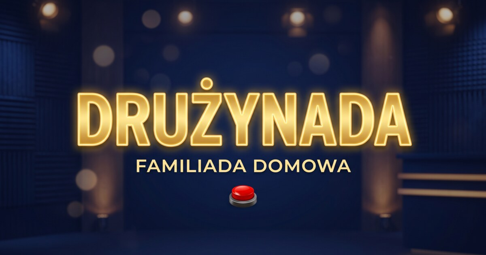
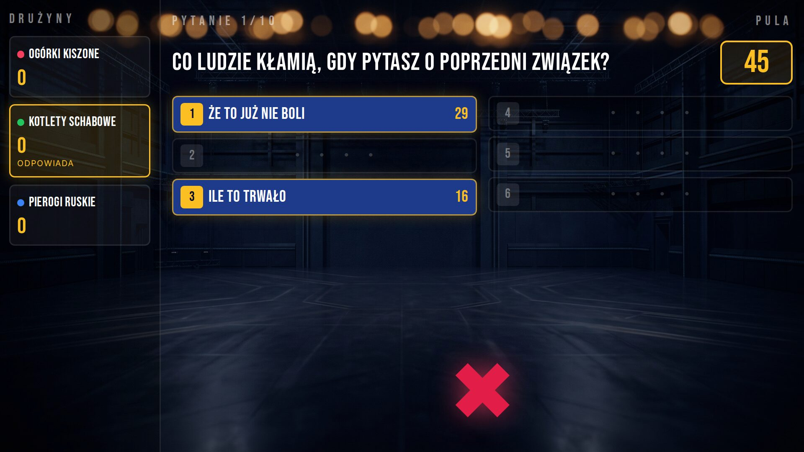
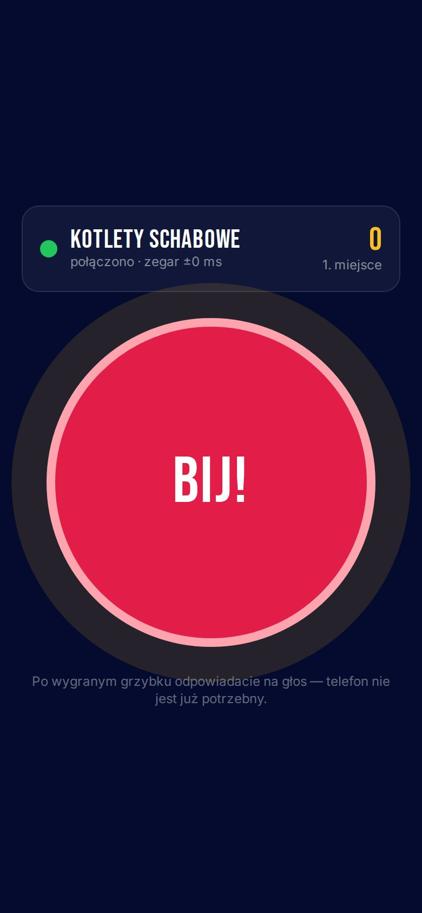
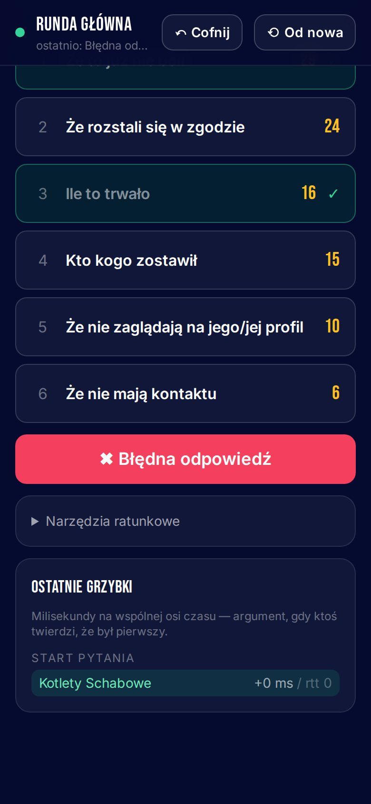
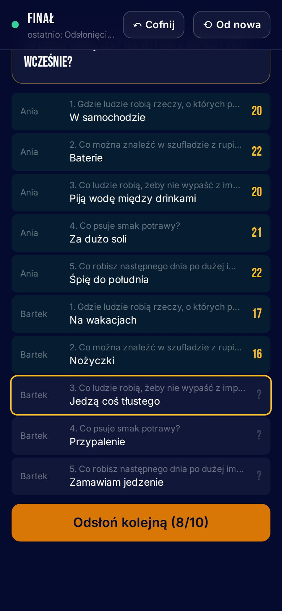
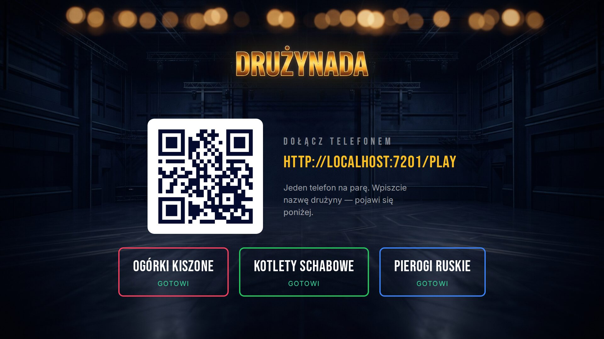
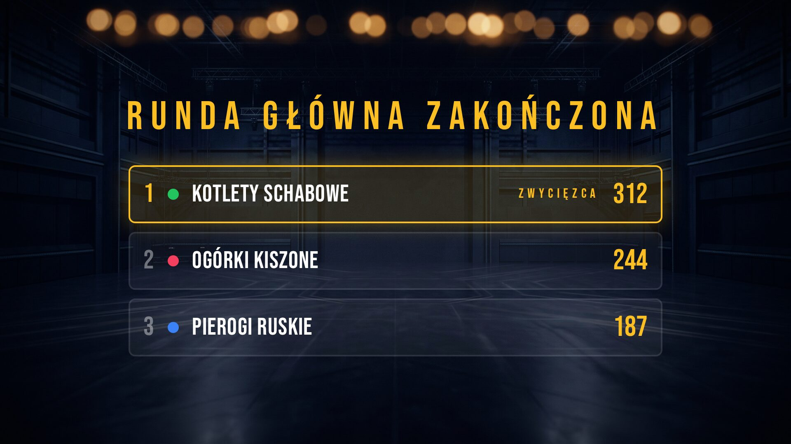
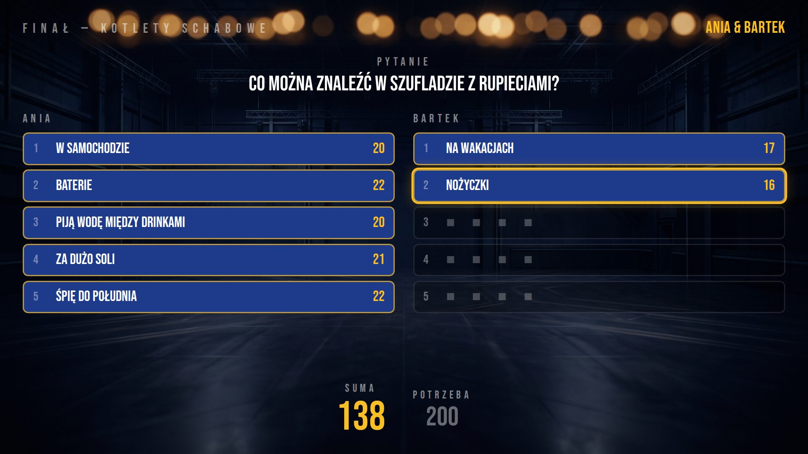
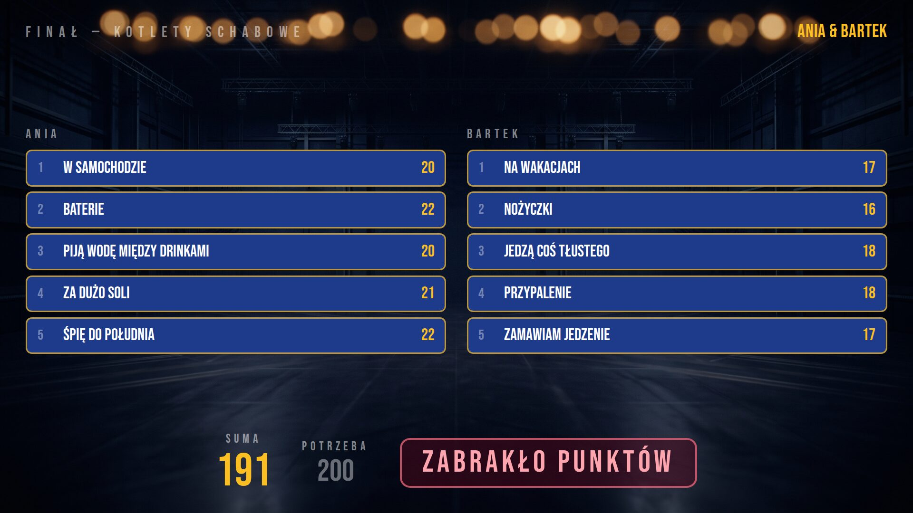

<p align="center">
  
</p>

<p align="center">
  <strong>Familiada na domówkę: telewizor w salonie, grzybki na telefonach, prowadzący z panelem w ręce.</strong><br />
  Dwie albo trzy drużyny, dziesięć pytań, przejęcia, finał o nagrodę główną. Self-hosted, bez kont i bez reklam.
</p>

<p align="center">
  <a href="https://buycoffee.to/pszejna"></a>
</p>

---

<p align="center">
  
</p>

## Spis treści

- [Jak to wygląda](#jak-to-wygląda)
- [Jak grać](#jak-grać)
- [Szybki start](#szybki-start)
- [Konfiguracja](#konfiguracja)
- [Wdrożenie](#wdrożenie)
- [Pytania, dźwięki, grafika](#pytania-dźwięki-grafika)
- [Dla programistów](#dla-programistów)
- [Wsparcie](#wsparcie)

## Jak to wygląda

Gra składa się z trzech ekranów w jednej aplikacji — każdy otwierasz na innym urządzeniu:

| Ekran | Gdzie | Co robi |
|---|---|---|
| **`/tv`** | telewizor, rzutnik, laptop podpięty do TV | plansza z odpowiedziami, punkty, X-y, finał, muzyka i efekty dźwiękowe |
| **`/admin`** | telefon prowadzącego (+ komputer do edycji pytań) | start pytań, zaznaczanie odpowiedzi, cofanie pomyłek, prowadzenie finału |
| **`/play`** | jeden telefon na drużynę | wielki grzybek — kto pierwszy, ten odpowiada |

<table>
  <tr>
    <td width="33%"></td>
    <td width="33%"></td>
    <td width="33%"></td>
  </tr>
  <tr>
    <td align="center">Grzybek drużyny</td>
    <td align="center">Prowadzący: runda główna</td>
    <td align="center">Prowadzący: odsłanianie finału</td>
  </tr>
</table>

<table>
  <tr>
    <td width="50%"></td>
    <td width="50%"></td>
  </tr>
  <tr>
    <td align="center">Lobby — drużyny dołączają przez kod QR</td>
    <td align="center">Ranking po dziesięciu pytaniach</td>
  </tr>
  <tr>
    <td width="50%"></td>
    <td width="50%"></td>
  </tr>
  <tr>
    <td align="center">Finał — odsłanianie odpowiedzi po kolei</td>
    <td align="center">Finał — wynik i werdykt</td>
  </tr>
</table>

## Jak grać

### Przygotowanie (5 minut)

1. **Telewizor** — otwórz `/tv` i kliknij ekran. To jedno kliknięcie włącza dźwięk i tryb pełnoekranowy (przeglądarki nie zagrają niczego bez interakcji).
2. **Drużyny** — każda para skanuje kod QR z telewizora i wpisuje nazwę drużyny. Wystarczy **jeden telefon na drużynę**; nazwy pojawiają się na TV od razu.
3. **Prowadzący** — otwiera `/admin`, loguje się hasłem, zaznacza pakiety pytań (albo zostawia wszystkie), klika **Losuj 10** i **Rozpocznij grę**.

Telefon, który przypadkiem odświeży stronę albo straci WiFi, wraca do swojej drużyny sam. Telewizor też.

### Runda główna

Dziesięć pytań. Każda odpowiedź ma wagę „ze stu ankietowanych" — im popularniejsza, tym więcej punktów.

1. Prowadzący klika **START** — pytanie pojawia się na telewizorze, a grzybki na telefonach się odblokowują.
2. Drużyna, która **pierwsza naciśnie grzybek**, odpowiada na głos. Kto był pierwszy, rozstrzyga serwer po zsynchronizowaniu zegarów telefonów, a nie to, czyj pakiet szybciej doleciał przez WiFi.
3. Prowadzący stuka trafioną odpowiedź na swoim telefonie — odsłania się na TV, a jej punkty trafiają do puli. Pudło to **✖**.
4. Drużyna odpowiada, dopóki nie zbierze **trzech X-ów** albo nie odsłoni całej planszy — wtedy zgarnia pulę.
5. **Przejęcie:** po trzecim X o pulę walczą pozostałe drużyny — przy trzech drużynach kolejnym grzybkiem, przy dwóch od razu przeciwnik. Przejmujący ma **jedną próbę**: jeśli trafi, bierze całą pulę razem z punktami swojej odpowiedzi.
6. Jeśli spudłują wszyscy, pula przepada, a prowadzący odsłania pozostałe odpowiedzi po jednej.

**Od szóstego pytania punkty liczą się podwójnie.** Po dziesiątym telewizor pokazuje ranking i zwycięzcę.

### Finał

Zwycięska drużyna wystawia dwoje graczy i gra o nagrodę główną.

1. Drugi gracz **wychodzi z pokoju** — telewizor przypomina o tym dużym napisem.
2. Prowadzący czyta pięć pytań, a pierwszy gracz odpowiada. Prowadzący stuka odpowiedź z listy, a gdy padnie coś spoza niej — wpisuje to w pole (zero punktów, ale widownia zobaczy, co padło) albo zaznacza pas.
3. Drugi gracz wraca i dostaje **te same pytania**. Telewizor nie pokazuje wtedy żadnych odpowiedzi partnera, tylko zajęte sloty. Jeśli drugi gracz powtórzy odpowiedź pierwszego, rozlega się brzęczyk i może spróbować jeszcze raz albo spasować.
4. Odsłanianie: prowadzący klika odpowiedź po odpowiedzi, a na telewizorze widać pytanie, do którego należy każda z nich. **200 punktów lub więcej** = nagroda główna.

Finał nie ma zegara — tempo nadaje prowadzący. Jeśli chcecie klasycznych 20 sekund, odmierzcie je telefonem.

### Narzędzia prowadzącego

- **↶ Cofnij** — kliknięta nie ta odpowiedź albo X przez pomyłkę? Jedno kliknięcie przywraca stan sprzed akcji.
- **⟲ Od nowa** — reset punktów bez rozłączania drużyn; wybrane pytania zostają.
- **Narzędzia ratunkowe** — podmiana pytania, ręczne przyznanie kontroli (gdy padnie telefon drużyny), wymuszenie przejęcia oraz **przewinięcie do finału**, które przydaje się na próbę przed imprezą.
- **Dwóch prowadzących** — panel można otworzyć na dwóch telefonach naraz. Jedna osoba czyta pytania, druga zaznacza odpowiedzi, a stan synchronizuje się na żywo.
- **Ostatnie grzybki** — milisekundy każdego naciśnięcia, na wypadek sporu „ja byłem pierwszy!".

## Szybki start

Potrzebujesz Dockera z Docker Compose.

```bash
git clone https://github.com/hazryn/cue.git druzynada
cd druzynada
docker compose up
```

Po chwili:

| Co | Adres |
|---|---|
| Strona główna | http://localhost:7201 |
| Telewizor | http://localhost:7201/tv |
| Prowadzący | http://localhost:7201/admin — hasło `familiada` |
| Gracze | http://localhost:7201/play |

Compose stawia bazę Postgres, backend i frontend, wykonuje migracje i wgrywa **80 gotowych pytań** w pięciu pakietach.

### Gra w domowym WiFi

Telefony muszą widzieć komputer, na którym stoi gra. Sprawdź jego adres w sieci (np. `192.168.1.20`) i wpisz go do pliku `.env.local` w katalogu projektu — z niego powstaje kod QR na telewizorze:

```bash
echo "PUBLIC_URL=http://192.168.1.20:7201" > .env.local
docker compose up -d
```

Wszystko idzie przez port 7201: telewizor otwiera `http://192.168.1.20:7201/tv`, prowadzący `…/admin`, a gracze skanują kod. Po zwykłym HTTP przeglądarka nie pozwala zablokować wygaszania ekranu, więc na czas gry wydłuż telefonom czas do wygaszenia albo postaw grę za HTTPS (patrz [Wdrożenie](#wdrożenie)).

> Porty to 7200 (API), 7201 (frontend) i 7202 (Postgres) — dobrane tak, żeby nie gryzły się z innymi projektami. Jeśli masz aktywny VPN, który przejmuje podsieci Dockera, ustaw wolną podsieć w `CUE_SUBNET` (domyślnie `10.172.72.0/24`).

## Konfiguracja

Domyślne wartości deweloperskie są w pliku `.env` w repozytorium. **Własne ustawienia wpisz do `.env.local`** — nadpisuje `.env` i nie trafia do gita.

| Zmienna | Domyślnie (dev) | Opis |
|---|---|---|
| `ADMIN_PASSWORD` | `familiada` | hasło do panelu prowadzącego — **zmień przed wystawieniem gry w internet** |
| `ADMIN_TOKEN_SECRET` | wartość dev | sekret podpisujący sesję prowadzącego; wygeneruj: `openssl rand -hex 32` |
| `PUBLIC_URL` | `http://localhost:7201` | adres, który trafia do kodu QR na telewizorze |
| `DB_HOST` / `DB_PORT` | `localhost` / `7202` | Postgres — poza trybem dev zwykle port `5432` |
| `DB_NAME` / `DB_USER` / `DB_PASSWORD` | `cue` / `cue` / `cue` | baza i użytkownik |
| `DB_SSL` | `false` | `true`, jeśli baza wymaga TLS |
| `PORT` | `7200` | port HTTP i WebSocket backendu |
| `VITE_API_URL` | `http://localhost:7200` | **tylko build frontendu**; w compose i w produkcji pusty — przeglądarka łączy się z tym samym adresem, z którego pobrała stronę |
| `API_PROXY_TARGET` | — | tylko dev-serwer Vite: dokąd przekazywać `/api` i `/socket.io` (w compose `http://api:7200`) |
| `CUE_SUBNET` | `10.172.72.0/24` | tylko `docker compose` — podsieć kontenerów |

Zasady rozgrywki — liczba pytań, od którego pytania działa mnożnik, próg finału, okno rozstrzygania grzybka — siedzą w `DEFAULT_CONFIG` w [`packages/shared/src/state.ts`](packages/shared/src/state.ts).

Logowanie do panelu ma limit 5 prób na 5 minut na adres IP.

## Wdrożenie

W produkcji całość to **jeden kontener**: backend serwuje API, WebSocket i zbudowany frontend.

### Docker

```bash
docker build --target prod -t druzynada .

docker run -d --name druzynada -p 7200:7200 \
  -e DB_HOST=twoj-postgres -e DB_PORT=5432 \
  -e DB_NAME=cue -e DB_USER=cue -e DB_PASSWORD='...' \
  -e ADMIN_PASSWORD='mocne-haslo' \
  -e ADMIN_TOKEN_SECRET="$(openssl rand -hex 32)" \
  -e PUBLIC_URL=https://gra.example.com \
  druzynada

# pytania startowe (jednorazowo; ponowne uruchomienie nie duplikuje wpisów)
docker exec druzynada node backend/dist/catalog/seed/run-seed.js
```

Migracje bazy wykonują się same przy starcie kontenera.

### Kubernetes

W [`deploy/k8s/`](deploy/k8s/) są manifesty, na których działa instancja autora (k3s + Traefik): Deployment, Service, Ingress i instrukcja z sekretami. Przed użyciem podmień domenę w Ingressie, obraz w Deploymencie i adres bazy.

### O czym pamiętać

- **HTTPS.** Gra działa też po zwykłym HTTP, ale blokadę wygaszania ekranu przeglądarki włączają tylko na stronach z HTTPS. Bez niej telefon, który przygaśnie, przegapi start pytania. Wystawiając grę w internet, postaw ją za reverse proxy z certyfikatem (Caddy, Traefik, nginx).
- **WebSocket.** Reverse proxy musi przepuszczać upgrade na ścieżce `/socket.io/`. Caddy i Traefik robią to domyślnie.
- **Jedna replika.** Rozstrzyganie grzybków i timery żyją w pamięci procesu, więc gra działa na jednej instancji. Na imprezę dla kilkunastu osób to z zapasem wystarczy.
- **Adres API jest wkompilowany we frontend.** Zmienne `VITE_*` są wstawiane podczas budowania, więc obraz produkcyjny bierze `.env.production` z pustym `VITE_API_URL` — przeglądarka łączy się wtedy z tym samym adresem, z którego pobrała stronę.

## Pytania, dźwięki, grafika

**Pytania.** 80 pytań w pięciu pakietach: klasyka rodzinna, kulinarne, imprezowe, polskie realia i 18+ (ten ostatni łatwo pominąć przy losowaniu). W panelu prowadzącego, w zakładce **Pytania**, dodasz własne pakiety, edytujesz pytania i odpowiedzi z wagami, a całe pytanie wkleisz jako tekst:

```
Co można znaleźć w kuchni?
Lodówka	32
Garnek	21
Nóż	15
```

Pytanie rundy głównej ma 3–10 odpowiedzi, finałowe dokładnie 10; wagi sumują się najwyżej do 100. Pytania startowe leżą w [`backend/src/catalog/seed/data/`](backend/src/catalog/seed/data/).

**Dźwięki.** Wszystkie 38 efektów i muzyka w lobby są syntezowane skryptem — bez sampli z sieci i bez kłopotów z licencjami:

```bash
python3 tools/generate_sounds.py            # wszystkie (wymaga numpy i ffmpeg)
python3 tools/generate_sounds.py strike_3   # jeden wybrany
```

Chcesz własne nagranie? Podmień plik o tej samej nazwie w `frontend/public/audio/`. Brakujący plik jest po prostu pomijany. Pełna lista z opisem momentów, w których grają, jest w [`frontend/public/audio/README.md`](frontend/public/audio/README.md).

**Grafika.** Logo, ikony i tło studia leżą w `frontend/public/brand/`.

## Dla programistów

```
packages/shared   typy stanu, zdarzeń i protokołu WebSocket — wspólne dla obu stron
backend/          NestJS + socket.io + TypeORM (PostgreSQL)
  src/game/engine czysty TypeScript: reduktor, maszyny stanów, punktacja, projekcje per ekran
  src/buzzer      synchronizacja zegarów telefonów i rozstrzyganie wyścigów
  src/catalog     pytania, pakiety, import, seed
frontend/         Vue 3 + Vite + Tailwind + Pinia — trzy widoki w jednej aplikacji
e2e/              testy Playwright grające prawdziwą partię
tools/            generator dźwięków i skrypt do zrzutów ekranu
```

Kilka decyzji, które warto znać:

- **Stan gry to snapshot plus log zdarzeń.** Każda akcja przechodzi przez jeden reduktor i ląduje w logu, więc cofnięcie to przeliczenie stanu od nowa, a restart serwera nie gubi rozgrywki.
- **Telewizor dostaje okrojony widok.** Treści nieodsłoniętych odpowiedzi nigdy nie wychodzą z serwera do ekranu TV — nawet podsłuchany WebSocket nie zdradzi odpowiedzi w finale.
- **Grzybek mierzy moment dotknięcia**, a nie dotarcia pakietu: telefon synchronizuje zegar metodą NTP-lite, a serwer zbiera naciśnięcia przez 250 ms i wybiera najwcześniejsze. Różnica poniżej 10 ms oznacza dogrywkę.

Pełny opis architektury i maszyn stanów: [`docs/design.md`](docs/design.md).

```bash
npm install
npm test                    # testy silnika gry (bez bazy, ok. 3 s)
npm run e2e                 # Playwright: pełna rozgrywka na żywej aplikacji
node tools/screenshots.mjs  # odświeża zrzuty ekranu do tego README
```

Testy Playwright da się też puścić przeciw wdrożonej instancji:

```bash
E2E_WEB_URL=https://gra.example.com E2E_API_URL=https://gra.example.com ADMIN_PASSWORD=... npm run e2e
```

## Wsparcie

Jeśli Drużynada rozkręciła Wam imprezę, możesz postawić autorowi kawę:

<p>
  <a href="https://buycoffee.to/pszejna"></a>
</p>

Błędy i pomysły zgłaszaj w [Issues](https://github.com/hazryn/cue/issues).
